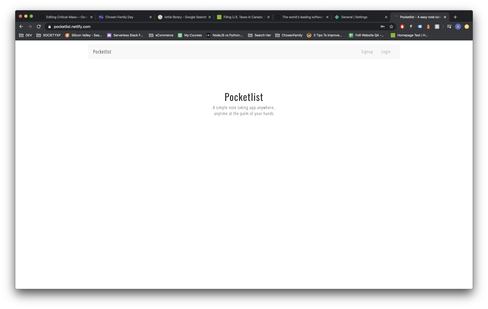
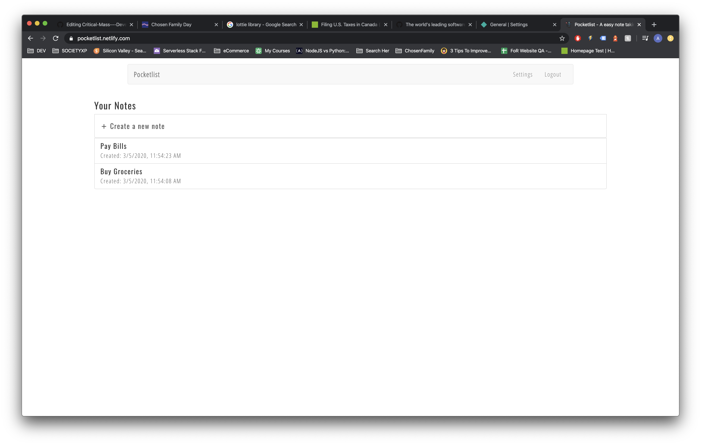
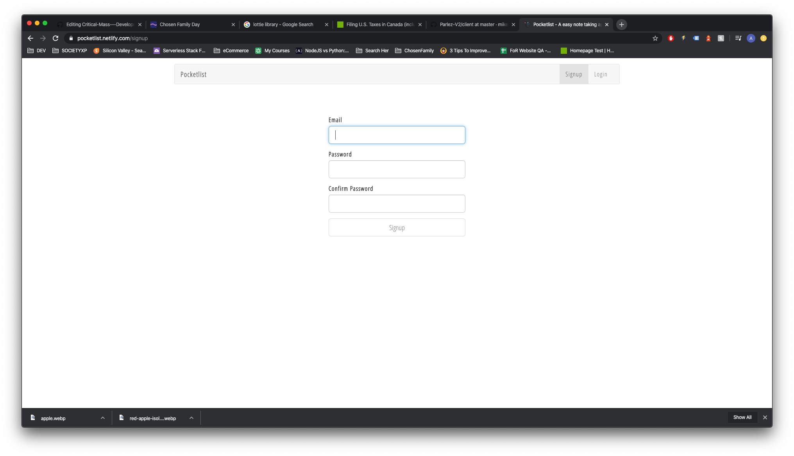
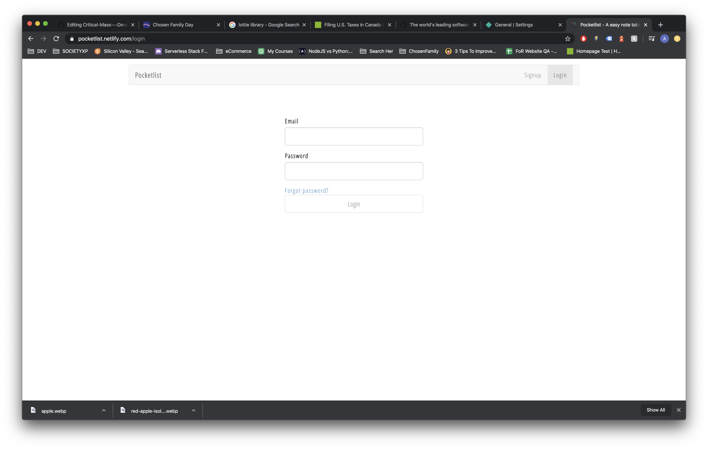
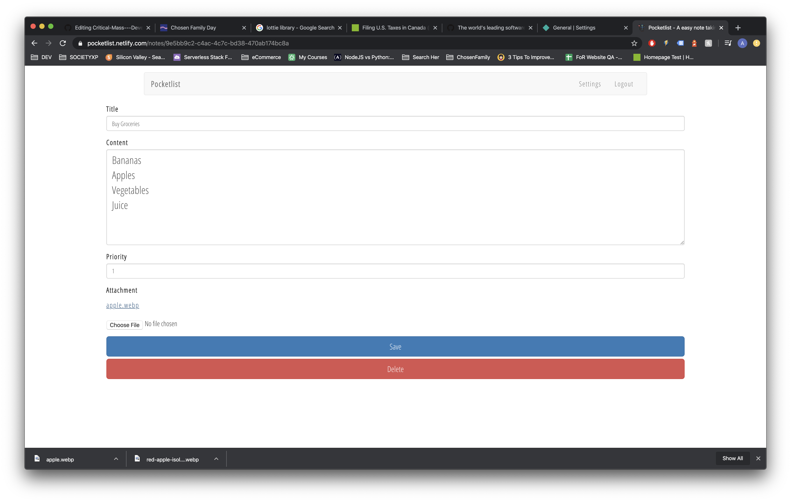

## Pocketlist - Serverless Stack Client

### [Server Side github repo](https://github.com/mikeyqq/serverless-stack-api)

---

# Tech Stack

### Front End

- React.js
- React Bootstrap

### Back End

- Amazon Web Services;
- Cognito
- API GATEWAY
- LAMBDA
- S3
- DYNAMODB

### CI/CD

- SEED.run

## Hosting

- Netlify

## Final Product

`Landing Page`

`Dashboard`

`signup page`

`login page`

`Notes Details`

